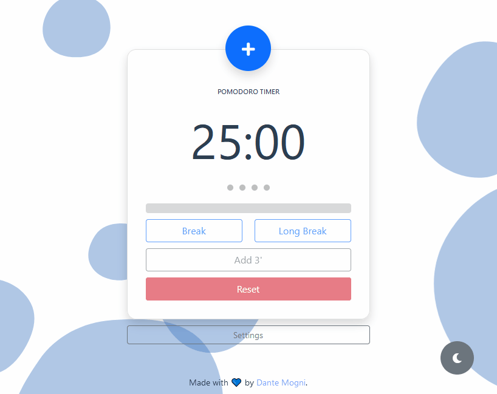

[](https://app.netlify.com/sites/pomodoro-dante/deploys)

# Pomodoro Web App ⏳🙇‍♂️
_Simple yet useful pomodoro timer._




#### Features
* Dark/Light theme support
* Fully Customizable:
    - Change the duration of the work session 
    - Change the duration of the break session 
    - Change the duration of the long break session 
    - Change the number of sessions until long break
* Ability to save a custom setting by bookmarking the URL and accessing from it later, so that you don't have to manually set it again 
* Browser notifications

---
## Project setup
```
yarn install
````

### Compiles and hot-reloads for development
```
yarn serve
```

### Compiles and minifies for production
```
yarn build
```

### Lints and fixes files
```
yarn lint
```